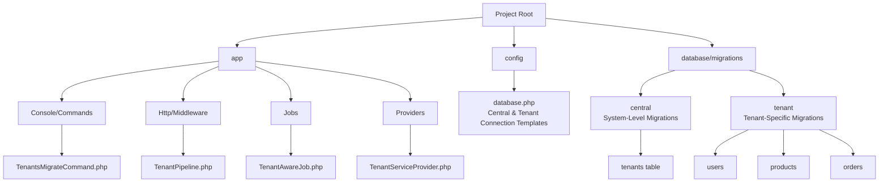

# Laravel SaaS Project Structure

```mermaid
flowchart TD
    A["Project Root"]

    A --> B["app"]
    B --> C["Console/Commands"]
    C --> D["TenantsMigrateCommand.php"]

    B --> E["Http/Middleware"]
    E --> F["TenantPipeline.php"]

    B --> G["Jobs"]
    G --> H["TenantAwareJob.php"]

    B --> I["Providers"]
    I --> J["TenantServiceProvider.php"]

    A --> K["config"]
    K --> L["database.php<br/>Central & Tenant Connection Templates"]

    A --> M["database/migrations"]

    M --> N["central<br/>System-Level Migrations"]
    N --> O["tenants table"]

    M --> P["tenant<br/>Tenant-Specific Migrations"]
    P --> Q["users"]
    P --> R["products"]
    P --> S["orders"]
```