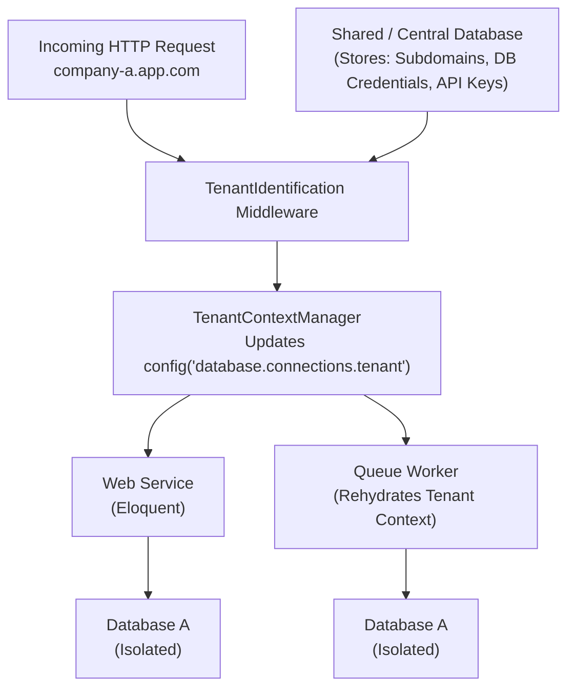

# Laravel SaaS Multi-Tenant Architecture

```mermaid
flowchart TD
    A["Incoming HTTP Request<br/>company-a.app.com"]
    B["TenantIdentification Middleware"]
    C["Shared / Central Database<br/>(Stores: Subdomains, DB Credentials, API Keys)"]
    D["TenantContextManager<br/>Updates config('database.connections.tenant')"]
    E["Web Service<br/>(Eloquent)"]
    F["Queue Worker<br/>(Rehydrates Tenant Context)"]
    G["Database A<br/>(Isolated)"]
    H["Database A<br/>(Isolated)"]

    A --> B
    C --> B
    B --> D
    D --> E
    D --> F
    E --> G
    F --> H
```